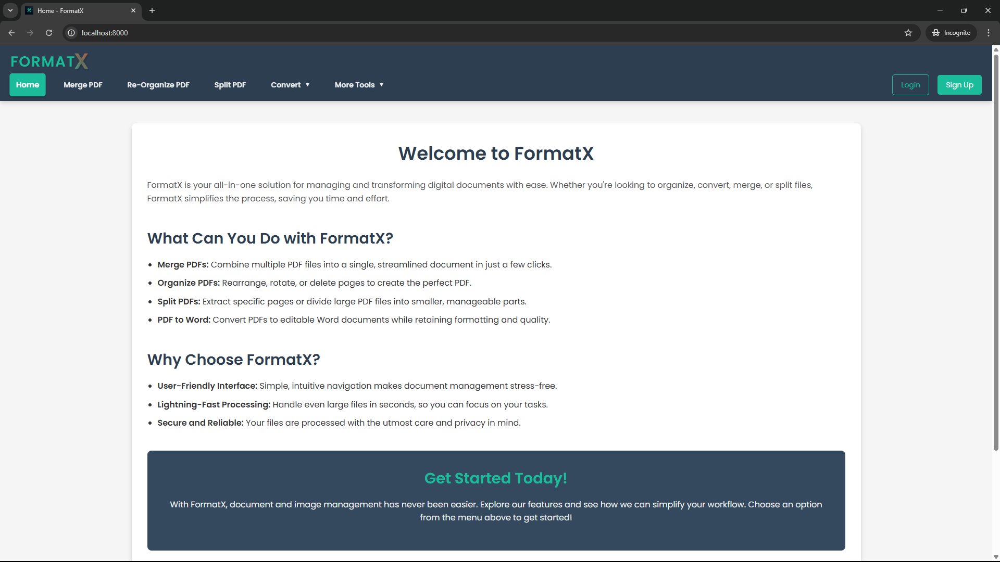

# FormatX
### Your All-in-One File Conversion System

Welcome to **FormatX**! This repository houses the ultimate solution for managing and transforming digital documents with ease. From conversions to organization, **FormatX** simplifies your workflow, saving you time and effort.

---

## 🚀 Features

### 🌟 Core Functionalities

- **Merge PDFs**  
  Combine multiple PDF files into a single, streamlined document in just a few clicks.

- **Organize PDFs**  
  Rearrange, rotate, or delete pages to create the perfect PDF.

- **Split PDFs**  
  Extract specific pages or divide large PDF files into smaller, manageable parts.

- **File Conversion**
  - Convert PDFs to editable Word documents.
  - Transform Word files into high-quality PDFs.
  - Convert PDFs to PowerPoint and vice versa.

### 🔒 Why Choose FormatX?

- **User-Friendly Interface**: Intuitive navigation makes document management stress-free.
- **Lightning-Fast Processing**: Handle even large files in seconds.
- **Secure and Reliable**: Your files are processed with the utmost care and privacy.

---

## 📸 Preview

### Home Page
  
> *The gateway to effortless document management.*

### Merge Tools
  

> *Select the desired transformation and let FormatX handle the rest.*

---

## 🛠️ Tech Stack

- **Frontend**: HTML, CSS, JavaScript.
- **Backend**: Python.
- **Deployment**: Flask.
---

## 📈 Roadmap

### ✅ Completed

- Merge and Organize PDFs.
- Core File Conversion functionalities.
- User-friendly web interface.

### 🛠️ Work in Progress

- Split and Convert PDFs
- Enhanced file security features.
- Drag-and-drop upload functionality for ease of use.
- Expanded support for more file types.

### 🎯 Upcoming Features

- Real-time progress notifications for long-running tasks.
- Integration with cloud storage solutions (Google Drive, Dropbox).
- Mobile-friendly design and possibly an IOS app.

---

## 📝 How to Use

1. Clone this repository: `git clone https://github.com/Blazzzin/formatx.git`
2. Navigate to the directory: `cd formatx`
3. Start the server:
    ```bash
    python app.py
    ```
4. Open your browser and visit: `http://localhost:5000`

---

### 👀 Stay Updated

Follow this repository for the latest updates. Visual improvements, new features, and optimizations are on the way!

---

Made by Saheer Multani.