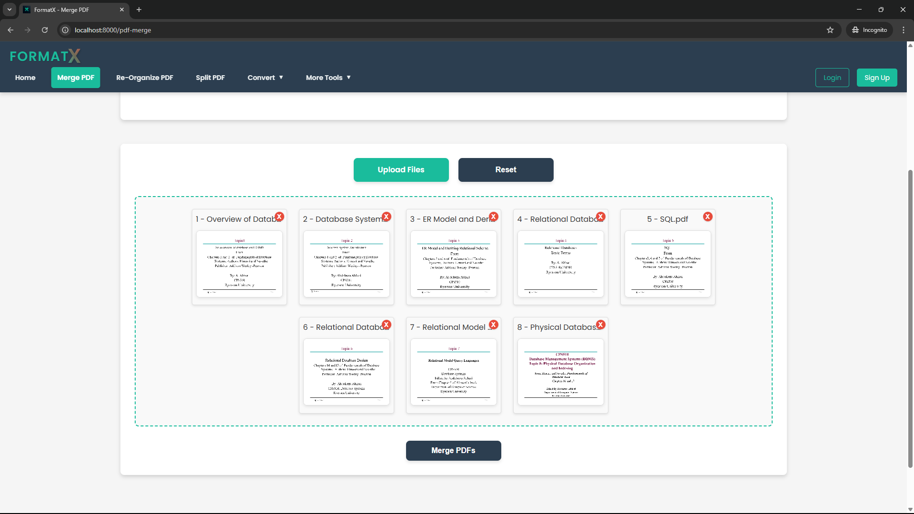
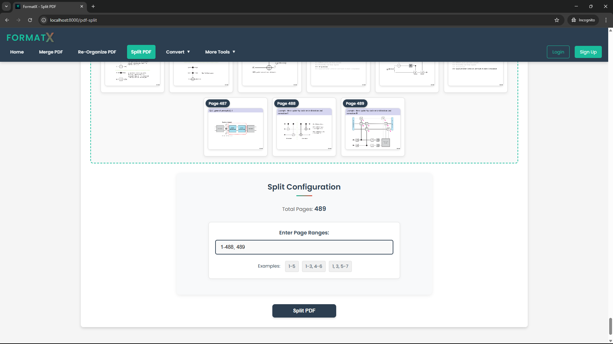

# FormatX  
### Your All-in-One File Conversion System

Welcome to **FormatX**! This repository is your ultimate solution for managing and transforming digital documents effortlessly. I have moved to a modern microservices architecture while keeping all the powerful features.

---

## 🛠️ Tech Stack

- **Frontend:** HTML, CSS, JavaScript.
- **Backend:** Python with Flask.
- **Database:** MongoDB.
- **Architecture:** Microservices (API Gateway, File Service, User Service, etc.).
- **Deployment:** Flask-based microservices.

---

## 🚀 Features

### 🌟 Core Functionalities

- **Merge PDFs**  
  Combine multiple PDF files into one streamlined document with just a few clicks.

- **Organize PDFs**  
  Rearrange, rotate, or delete pages to create the perfect PDF.

- **Split PDFs**  
  Extract specific pages or break up large PDFs into smaller, manageable parts.

- **File Conversion**  
  - Convert PDFs to editable Word documents.
  - Transform Word files into high-quality PDFs.
  - Convert PDFs to PowerPoint (and vice versa).

The new microservices setup means each feature is powered by dedicated services like the API gateway, file service, and user service—making the system more robust, scalable, and easier to maintain.

---

## 📸 Preview

### Home Page  
  

### Merge Tools  
  

### Organize Tools  
  

### Split Tools  
  
  

---

## 📈 Roadmap

### ✅ Completed

- Merge, Organize, and Split PDFs.
- Login/Sign Up functionality.
- User Authentication with JWT.
- Core File Conversion features.
- A user-friendly web interface.
- Transition from a monolithic to a microservices architecture.

### 🛠️ Work in Progress

- Implenting conversion features.
- Improved file security measures.
- Implementing drag-and-drop upload functionality.
- Expanding support for additional file types.
- Developing an iOS app with help from [@jawlessjman](https://github.com/jawlessjman).

### 🎯 Upcoming Features

- Real-time progress notifications for long-running tasks.
- Integration with cloud storage solutions (Amazon S3).
- Containerization with Docker and scalable deployment on Google Cloud or AWS.

---

Made by Saheer Multani.